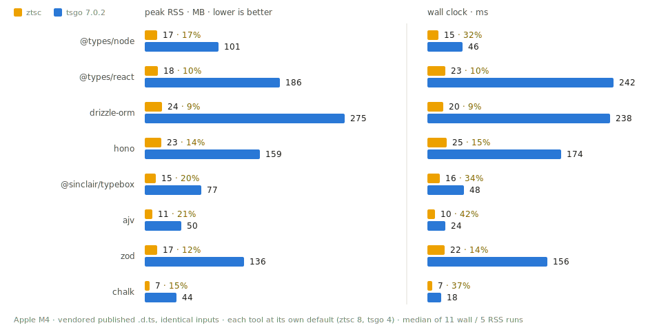

# ztsc

An extremely fast, low-memory TypeScript type checker, written in Zig.

**Documentation:** https://gustavoschmidt.github.io/ztsc/

- **8–21% of tsgo's peak memory** (the native TypeScript 7 compiler) on real
  packages — and faster, not slower.
- A **single static binary**. No Node runtime, no dependencies.
- **Zero dependencies in the source, too** — the Zig code uses nothing but
  the Zig standard library; `build.zig.zon` lists no packages.
- **Parallel by design**, with byte-identical output at any worker count.
- Diagnostics **match the TypeScript compiler**, enforced by a 400-case
  differential conformance suite.

> [!WARNING]
> ztsc is pre-release and not ready for production use. It checks a large,
> well-defined subset of TypeScript — full feature parity is in the works.

## Benchmarks

Seven real, published packages on an Apple M4, identical inputs, both tools at
their default 4 checkers — ztsc uses **8–21% of tsgo's peak memory** and is **1.6–10× faster** (wall clock measured
with a millisecond-precision timer; the smallest packages sit near both tools' process
floors):

<picture>
  <source media="(prefers-color-scheme: dark)" srcset="docs/benchmarks-dark.svg">
  
</picture>

Full results, methodology, and limitations of the comparison:
[BENCHMARKS.md](BENCHMARKS.md).

## Getting started

v0.0.1 is not on npm yet. Once it is:

```sh
bunx ztsc        # or: npx ztsc
```

Until then, build from source — all you need is [Zig](https://ziglang.org)
0.16.0:

```sh
zig build -Doptimize=ReleaseFast   # -> zig-out/bin/ztsc
```

Point it at a project and it does the rest:

```sh
ztsc                       # finds tsconfig.json in cwd or a parent
ztsc -p path/to/project    # explicit tsconfig
ztsc src/main.ts           # or explicit entry files
```

Run `ztsc --help` for all options.

## Limitations

ztsc is a batch checker for strict-mode TypeScript. What it checks, it checks
like `tsc` — but it does not check everything yet:

- **DOM lib via `lib`.** The embedded standard library ships the ES-core..esnext
  surface plus the real TypeScript DOM lib (`dom` + `dom.iterable` +
  `dom.asynciterable`). The tsconfig `compilerOptions.lib` field selects blobs:
  a list replaces the default (tsc semantics), recognizing the `es*` and `dom*`
  families (other families warn + ignore). With no `lib` field the default is
  ES-core + DOM, matching tsgo's target-esnext default, so browser globals
  (`Response`, `HTMLElement`, `fetch`, `document`, `console`, …) resolve.
  `lib:["esnext"]` gives the backend configuration (no DOM). Known gap:
  `for…of` over a DOM collection whose iterator is added by interface merging
  (e.g. `URLSearchParams`, `Headers`) is not yet recognized (a pre-existing
  merged-interface iterator limitation, also affecting `for await` over
  `AsyncIterable`); single-declaration iterables like `NodeListOf` work.
- **CommonJS interop is checked** (`export =`, `import x = require(…)`, and
  default/named/namespace ES imports against an `export =` module), but a couple
  of corners degrade leniently rather than erroring: a namespace import keeps the
  export's call signature (`ns()` is not flagged), and a member of a
  `require`-bound namespace used in *type* position resolves to `any`.
- **Const-symbol computed keys are checked** (`[kind]: T` where `kind` is a
  const `unique symbol`) — in classes, interfaces, type literals and object
  literals, keyed by the symbol's nominal identity across files (an imported
  key resolves to its declaring site, and reading with a *different* symbol is
  a TS7053). Member-expression keys are checked too: a class-static symbol
  (`[EventEmitter.captureRejectionSymbol]`) or a namespace export
  (`[promisify.custom]`) resolves to the same nominal identity. Two lenient
  corners: a plain non-`unique` `symbol` key (rxjs's `[Symbol.observable]`,
  declared `: symbol`) is keyed by name rather than as a symbol index, and a
  deeper-qualified key (`[a.b.c]`) stays out of subset — both under-report
  rather than erroring.
- **JSX is checked against the real `@types/react`** — the global `JSX`
  namespace merged out of the package (`declare global` in 18.x, or any
  user-authored namespace), intrinsic props via `IntrinsicElements`
  (including `DetailedHTMLProps` intersections), function- and
  class-component props, spread attributes (`<C {...p} />`: required-prop
  satisfaction, later-wins overwrites/TS2783, non-object spreads/TS2698,
  weak-type TS2559), `key` via `IntrinsicAttributes`, and children via
  `ElementChildrenAttribute` — differentially matched against tsgo (see
  `test/react_accept_real`). Lenient corners (under-report, never a false
  positive): prop *type* mismatches arriving inside a spread object, spreads
  of unions/generics/index-signature types, children *value* typing
  (TS2745/2746), and class-component prop mistakes report refined codes
  (TS2741/2322) where tsgo's real-React path reports TS2769.
- **tsconfig subset**: `files` / `include` / `exclude` / `baseUrl` / `paths`,
  strict mode only; other options are accepted and ignored.
- **No watch mode or LSP yet** — both are planned next, on an architecture
  built for them.
- In a handful of known edge cases ztsc misses an error tsc would report. It
  never reports an error on valid code.

Unsupported syntax produces a clear "not yet supported" diagnostic — never a
wrong answer or a crash. Feature parity is in the works.

## License

MIT. The embedded standard library and the diagnostic messages are derived
from Microsoft's [TypeScript](https://github.com/microsoft/TypeScript)
(Apache-2.0) — see [NOTICE](NOTICE).
