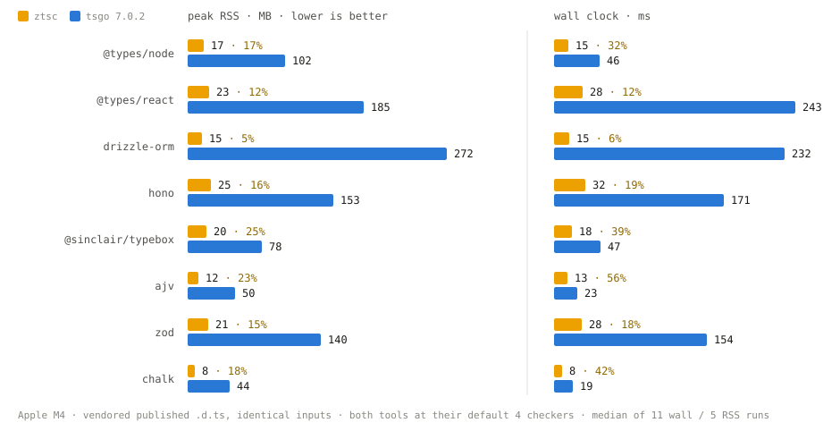

# ztsc

A fast, memory-lean TypeScript type checker, written in Zig.

No JS emit, no Node runtime — a **single static binary** with **zero
dependencies**, nothing but the Zig standard library. It checks a large,
well-defined subset of strict-mode TypeScript with diagnostics that match the
TypeScript compiler, byte-identical at any parallelism.

**Full documentation:** https://gustavoschmidt.github.io/ztsc/

- **3.3–16× less peak memory** than tsgo (the native TypeScript 7 compiler) —
  4.8–16× on eight benchmark packages, 3.3× on a full production app.
- **Faster on every benchmark** — up to 11× on the packages, 1.3× on the
  app; wall clock, defaults vs. defaults.
- **0 dependencies** — the Zig source uses nothing but the Zig standard
  library; the binary needs nothing but your OS.
- **630/630 conformance** — differential cases (error code + line) against the
  native TypeScript compiler, tsgo 7.0.2.

> [!WARNING]
> ztsc is pre-release and not ready for production use. It checks a large,
> well-defined subset of strict-mode TypeScript — see
> [What it can't do yet](#what-it-cant-do-yet). Full feature parity is in the
> works.

## Benchmarks

**Faster and smaller than tsgo — on every benchmark.** Eight real
packages' published `.d.ts`, vendored at pinned versions, both tools checking
identical inputs at their default 4 checker instances on an Apple M4: ztsc's
peak memory is **6–21% of tsgo's** and its wall clock **9–58%** — 3.0–11×
faster on everything bigger than the process floor.

<picture>
  <source media="(prefers-color-scheme: dark)" srcset="docs/benchmarks-dark.svg">
  
</picture>

Declaration files exercise the type-level machinery; real application source
exercises the rest. On a large production React/TypeScript app — full
`.ts`/`.tsx`, frontend and backend — ztsc finishes in **0.40 s and 219.6 MB**
against tsgo's 0.53 s and 734 MB, while reproducing all 48 of tsc's errors
byte-identically.

All eight packages, the application run, methodology, and how to reproduce
every number: [BENCHMARKS.md](BENCHMARKS.md) · [benchmarks
page](https://gustavoschmidt.github.io/ztsc/benchmarks.html).

## Getting started

v0.0.1 is not on npm yet — once it ships, `bunx ztsc` / `npx ztsc` will run it
with no install step. Until then, build from source — all you need is
[Zig](https://ziglang.org) 0.16.0; there are no dependencies to fetch:

```sh
git clone https://github.com/gustavoschmidt/ztsc
cd ztsc
zig build -Doptimize=ReleaseFast   # -> zig-out/bin/ztsc
```

Point it at a project and it does the rest:

```sh
ztsc                       # finds tsconfig.json in cwd or a parent
ztsc -p path/to/project    # explicit tsconfig
ztsc src/main.ts           # or explicit entry files
```

Diagnostics are tsc-style, with source excerpts and matching error codes:

```
demo.ts:1:19 - error TS2322: Type 'string' is not assignable to type 'number'.

1 const n: number = "hi";
                    ~~~~
```

(The comparison baseline is just as easy to get: tsgo is
`npm i @typescript/native-preview`.)

Full usage — CLI options, the tsconfig subset, exit codes:
[usage page](https://gustavoschmidt.github.io/ztsc/usage.html).

## Why it's fast

There is no exotic trick. The entire performance story is **data-oriented
design applied with total consistency** — five ordinary decisions, enforced in
the AST, the binder, the type store, and the module graph, with no exceptions:

- **Indices, not pointers.** Every structure is flat arrays addressed by
  `u32` — half a pointer's size, and traversals stream through cache lines.
- **Struct-of-arrays.** A pass that only needs node tags touches a
  1-byte-per-node array and nothing else.
- **Arenas, no frees, no GC.** Allocation is a pointer bump; footprint equals
  live data — no collector headroom.
- **Intern everything, compare integers.** Strings become atoms once, types
  are hash-consed into `TypeId`s once; equality is an integer compare forever
  after.
- **Seal, then share.** Each phase's output is frozen before the next phase
  reads it — so the entire check phase runs lock-free with zero shared mutable
  state.

That's why the numbers hold on both axes at once: 16 bytes per AST node, 5 per
token, 28 per type, ~187 bytes of heap per source line all-in — and the same
flat, sealed structures that shrink memory are the ones a CPU cache is fastest
at reading. Where tsgo's collector needs headroom and its objects carry
headers and 64-bit pointers, ztsc's footprint *is* its live data.

The internals tour — the pipeline, the u32 decision, the memory design, the
parallelism: [internals page](https://gustavoschmidt.github.io/ztsc/internals.html)
· [ARCHITECTURE.md](ARCHITECTURE.md).

## What it can't do yet

**ztsc is pre-release and not ready for production use.** It checks a large,
well-defined subset of strict-mode TypeScript — watch mode, an LSP, and
Windows are the biggest gaps, all planned. Unsupported syntax produces a clear
"not supported" diagnostic, never a crash, and known gaps *under-report*
rather than inventing errors on valid code: on the production dogfood app it
reproduces all 48 of tsc's errors byte-identically and adds 10 tracked false
positives. `ztsc --census` tells you in one command exactly which unsupported
constructs your own project contains.

On Windows specifically, ztsc does not build or run yet: the checker's
per-symbol state lives in demand-zeroed anonymous memory obtained with POSIX
`mmap` (`src/zeropage.zig`) — untouched pages never become resident, which is
load-bearing for the memory numbers above — and the Windows equivalent
(`VirtualAlloc`) is not wired in, so a Windows target fails at compile time
with a clear error. macOS and Linux work today; a Windows port is planned.

The full list — every gap, how it behaves today, and what's planned:
[limitations page](https://gustavoschmidt.github.io/ztsc/limitations.html).

## Why this exists

AI writes code fast, so the tooling that checks that code has to be fast and
cheap to run. A type checker used to be a tool a person ran occasionally; now
it is **infrastructure that machines call at high frequency and high
concurrency** — dozens of invocations per agent session, fleets of
memory-capped sandboxes running instances simultaneously. That shift makes
memory per instance a density limit, the startup floor a multiplied cost, and
deterministic output a cache key. tsgo settled the speed question; ztsc's bet
is that *memory is where a systems language beats a garbage-collected one* —
and that if you design for memory with total consistency, speed comes along
for free.

The full argument — the memory bet, the measured subset, hard determinism, and
the experiments that didn't land:
[rationale page](https://gustavoschmidt.github.io/ztsc/rationale.html).

## Read more

- [Usage](https://gustavoschmidt.github.io/ztsc/usage.html) — building, CLI
  options, the tsconfig subset, exit codes.
- [Benchmarks](https://gustavoschmidt.github.io/ztsc/benchmarks.html) — full
  results on packages and application source, the parallelism sweep,
  methodology, and how to reproduce.
- [Internals](https://gustavoschmidt.github.io/ztsc/internals.html) — a guided
  tour of how the checker works: the pipeline, the pointer-free data
  structures, the memory design, the parallelism.
- [Rationale](https://gustavoschmidt.github.io/ztsc/rationale.html) — why this
  exists: the memory bet, why a measured subset, why determinism is a hard
  guarantee, and the experiments that didn't land.
- [Limitations](https://gustavoschmidt.github.io/ztsc/limitations.html) —
  what's not checked yet, the false-positive ledger, and what's planned: watch
  mode, LSP, Windows, npm.

## License

MIT. The embedded standard library and the diagnostic messages are derived
from Microsoft's [TypeScript](https://github.com/microsoft/TypeScript)
(Apache-2.0) — see [NOTICE](NOTICE).
